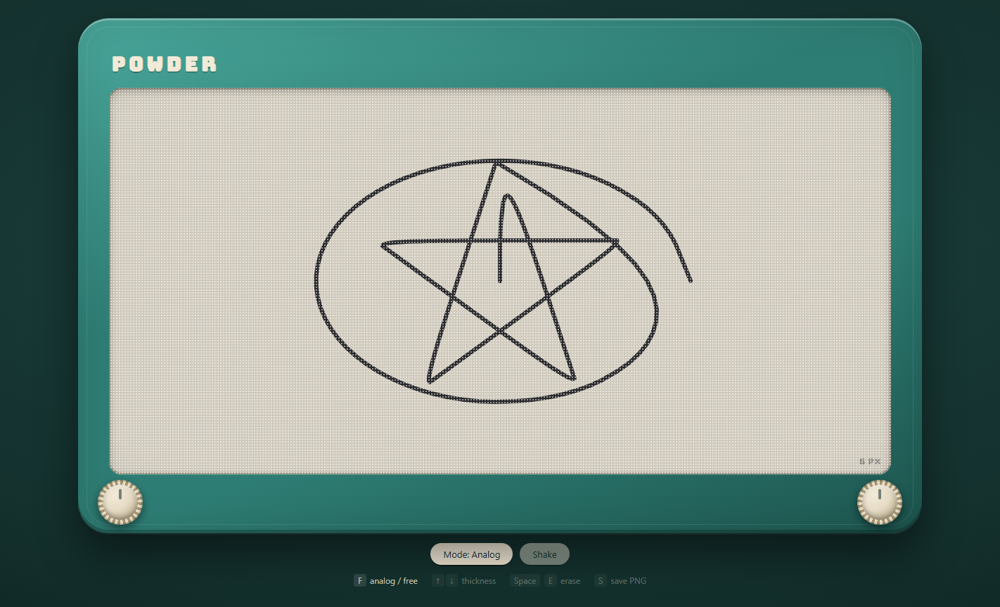

# SILVERTRACE
A browser drawing toy: one continuous line that you steer instead of draw.
Inspired by the mechanical knob-and-stylus toys of the 1960s, rebuilt for the web
with vanilla HTML, CSS, and JavaScript. No frameworks, no build step.

CRCP 6330 — Creative Coding for the Web — Week 2 Studio.

---

## Spec

**The idea.** A chunky plastic toy fills the screen. Its window is a canvas coated
in warm gray powder. A stylus sits behind the powder and is *always touching it* —
there is no "pen up." Move the pointer and the stylus chases it, lagging behind
with a bit of easing, so lines swoop and overshoot the way they do when you are
cranking two knobs at once. Shake it to wipe it clean.

**Modes**

| Mode | How you get there | Behavior |
| --- | --- | --- |
| Analog *(default)* | on load | Stylus starts at center, is always down, chases the pointer with easing (~0.15 lerp per frame). No clicking. |
| Free | press `F` or the mode button | Ordinary click-and-drag drawing. Pointer down draws, pointer up stops. |

**Controls**

| Input | Effect |
| --- | --- |
| Move pointer | Steer the stylus (analog) / draw while held (free) |
| `F` | Toggle analog ↔ free |
| `↑` / `↓` | Line thickness, 1–40, accelerating while held |
| `Space` or `E` | Erase |
| Shake the mouse | Erase (6+ horizontal direction reversals inside ~600 ms) |
| Shake button | Erase |
| `S` | Save the drawing as a PNG |

**Erase** is not an instant clear. The frame plays a short shake animation while the
drawing fades out over ~600 ms, like powder recoating the inside of the screen.

**Constraints**

- Vanilla HTML/CSS/JS. Opening `index.html` in a browser is the entire build process.
- One `<canvas>`. Pointer events throughout, so touch and stylus input work.
- Resizing the window must **not** wipe the drawing. Strokes are kept as a list of
  segments in normalized coordinates and redrawn at the new size.
- Original retro-toy visual design, not a replica of any product. Palette lives in
  CSS custom properties.

---

## Plan

### Files

| File | Role |
| --- | --- |
| `index.html` | Page structure: toy frame, canvas, knobs, HUD, keyboard legend |
| `style.css` | Palette variables, frame and knob design, screen grain, shake animation |
| `sketch.js` | Stylus state, the rAF loop, segment list, redraw, resize, input handling |
| `README.md` | This document |

### Build order

1. **spec+plan** — README, plus the empty HTML/CSS/JS skeleton with the frame and canvas.
2. **build** — analog stylus, continuous line, resize handling, and the frame design.
3. **feature branches** — thickness keys, erase + fade, save-PNG, and knob rotation each
   get their own branch, PR, and merge. Each is marked with a `TODO` in `sketch.js`
   describing the intended approach.

### Team

| Name | Role | Owns |
| --- | --- | --- |
| *(placeholder)* | Core / drawing engine | `sketch.js` stylus loop, segments, resize |
| *(placeholder)* | Visual design | `style.css` frame, knobs, grain, motion |
| *(placeholder)* | Interaction | Thickness keys, mode toggle, HUD |
| *(placeholder)* | Erase + export | Shake detection, fade-out, PNG save |

---

## How to run

```
git clone https://github.com/SteveElias78/CRCP-6330-Creative-Coding-for-the-Web.git
cd CRCP-6330-Creative-Coding-for-the-Web
```

Then open `index.html` in a browser — double-click it, or:

```
start index.html        # Windows
open index.html         # macOS
xdg-open index.html     # Linux
```

No server, no install, no dependencies. If you would rather serve it:

```
python -m http.server 8000
```

and visit <http://localhost:8000>.

---

## Expected output

A teal toy frame filling the viewport with a warm gray screen inside it. Moving the
mouse leaves one continuous charcoal line that trails behind the cursor. Two knobs in
the bottom corners. A thickness readout in the corner of the screen and a keyboard
legend below the frame.



Captured from the running app. The mouse traced a five-pointed star and then a
loop around it — note where the line overshoots each point of the star and cuts
the corner instead of turning sharply. That is the easing, and it is the whole
character of the toy.

**Inspected while running:** 433 segments recorded from one continuous stroke;
shrinking the window from 1440×960 to 900×700 rebuilt the canvas backing store
at the new size with all 433 segments intact and ~16k pixels of ink still on the
screen; `F` toggled to free mode, where moving the pointer with no button held
correctly recorded nothing; no console errors or exceptions.

---

## Future work

- **A vision model guesses what you drew.** Send the canvas PNG to a multimodal model
  and show its guess as a caption under the frame — the toy plays Pictionary back at you.
- Undo, as a pop off the segment list plus a redraw.
- Two-knob keyboard control: arrow keys drive x and y directly, no pointer at all.
- Replay: animate the segment list from the first stroke to the last.
- Save and restore drawings from `localStorage`.
- Line texture that thins with speed, like a real stylus skipping over powder.

---

## AI-native note

This project is AI-native by construction. The app was **specified in natural language**
and built with **Claude Code** — the prompt described the toy, its modes, its controls,
and its visual language, and the implementation was generated, reviewed, and committed
from that description rather than typed by hand.

The workflow is the deliverable as much as the app is. Every commit message is prefixed
with the **stage of the loop** it belongs to, so the history reads as a record of the
process:

- `spec+plan:` — deciding what to build and writing it down
- `build:` — implementing against the spec
- `review:` — changes that came out of reading a diff
- `fix:` — corrections found by running and inspecting the app

Features beyond the core are developed on feature branches and merged through pull
requests, so the diff for each one can be reviewed on its own.
